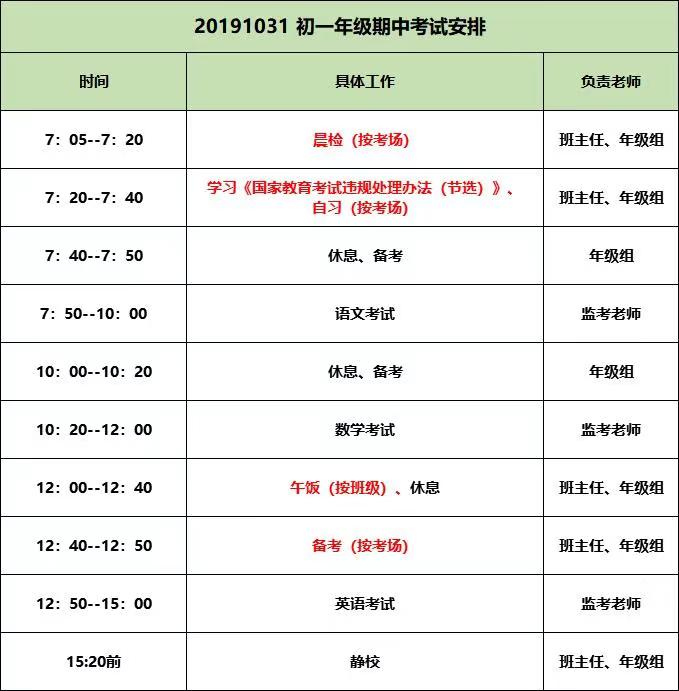

# 首页

- [FAQ](../wiki/faq)
- [English FAQ](../wjch/en/faq-en)
- [HOW TO](../wiki/how-to)
- [Wikipedia](../wiki/wiki)

---

<!-- 
<video controls="controls">
    <source src="../lib/movie.mp4" type="video/mp4" />
    <source src="../lib/movie.ogg" type="video/ogg" />
</video>

<audio src="../lib/song.ogg" controls="controls"></audio> 
-->

Physical Fitness

<video controls="controls">
    <source src="../lib/physical-fitness-1.mp4" type="video/mp4" />
</video>
<video controls="controls">
    <source src="../lib/physical-fitness-2.mp4" type="video/mp4" />
</video>

---

## 信息

- 北京市朝阳外国语学校
- 初一、初二地址：北京市朝阳区亚运村慧忠北里203号
- 朝阳区科荟路慧忠北里第二社区(北1门)
- 7:25前收完；16:50放学；17:15静校
- 酒仙桥望京线班车京B21643，司机蔡师傅
- 2019-10-08北线换了一个22座的班车京E B2538

---

## 学期

### 初一第一学期

- 2019年9月1日（星期日）开学;
- 2020年1月17日（星期五）结束本学期工作，共19周零6天；
- 2020年1月18日（星期六）至2月16日（星期曰）放寒假，共4周零2天。

### 初一第二学期

- 2020年2月17日（星期一）开学；
- 2020年7月10日（星期五）结束本学期工作，共20周零5天；
- 2020年7月11日（星期六）至8月31日（星期一）放暑假，共7周零3天。

---

## 课程表（2019级初一上）

| 节次 | 周一 | 周二 | 周三 | 周四 | 周五 |
| ---- | ---- | ---- | ---- | ---- | ---- |
| 1    | 数学 | 数学 | 英语 | 地理 | 数学 |
| 2    | 数学 | 语文 | 英语 | 语文 | 物理 |
| 3    | 外教 | 体育 | 体育 | 体育 | 语文 |
| 4    | 语文 | 科学 | 信息 | 英语 | 语文 |
| 5    | 政治 | 生物 | 历史 | 班会 | 历史 |
| 6    | 书法 | 地理 | 音乐 | 数学 | 英语 |
| 7    | 英语 | 英语 | 数学 | 数学 | 美术 |
| 8    | 美术 | 英语 | 语文 | 音乐 | 政治 |

---

## Examine

### 2019.10.8月考安排

| 时间         | 事务           |
| ------------ | -------------- |
| 7:05-7:45    | 晨检           |
| 7:45-7:55    | 休息、备考     |
| 7:55         | 发语文试卷     |
| 8:00-10:00   | 语文           |
| 10:00-10:15  | 休息、备考     |
| 10:15        | 发数学试卷     |
| 10:20-11:50  | 数字           |
| 11:50-12:25  | 休息、备考     |
| 12:25        | 发英语试卷     |
| 12:30 -13:30 | 英语           |
| 13:30-13:45  | 休息、备考     |
| 13:45        | 发史地政生试卷 |
| 13:50-15:20  | 发史地政生     |
| 15:20-15:30  | 休息、排队     |
| 15:40-16:45  | 丑小鸭排练     |

| 科目 | 滿分值 | 时长（分钟） | 9/6小 | 10/8月 |10/31|
| ---- | ------ | ------------ | ----- | ------ |---|
| 语文 | 100    | 120          |       | 76     |74()|
| 数学 | 100    | 90           |       | 88     |84(100)|
| 英语 | 100    | 60           |       | 94     |86(99)|
| 三科 | 300    |              |       | 258    |244|
| 历史 | 30     | 20           |       | 25     |
| 地理 | 30     | 20           |       | 24     |
| 生物 | 30     | 20           |       | 22     |
| 政治 | 40     | 30           |       | 31     |
| 总分 | 460    |              |       | 360    |

[语文期中检测](https://wenku.baidu.com/view/8e67f26c9fc3d5bbfd0a79563c1ec5da51e2d65d.html)

“哦!终于找到你啦!”罗西塔姆教授开心地说。多年来，他一直在寻找雪人。关于雪人，有许多许多传说，可是，雪人真正的样子，谁都没有见过。终于有一天，在最高最高的一座山顶上，教授面前突然出现了一个庞然大物——雪人!

### [2019-2020学年第一学期期中校考安排](../img/grade7/20191026_grade7-1期中考试.jpg)

| 日期      | 年级 | 科目                                      | 科目            | 科目            |
| --------- | ---- | ----------------------------------------- | --------------- | --------------- |
| 10.28周一 | 初一 | 地理16:15-16:55                           |
| 10.29周二 | 初一 | 生物16:15-16:55                           |
| 10.30周三 | 初一 | 语文8:00-10:00                            | 数学10:30-12:00 | 英语13:30-15:00 |
|           | 初二 | 语文8:00-10:00                            | 数学10:30-12:00 | 英语13:30-15:00 |
| 10.31周四 | 初一 | 英语听说考试,每2班/2个机房/40分钟顺序进行 |
|           | 初二 | 数学8:00-10:00                            | 英语10:30-12:00 | 物理13:30-15:00 |
| 11.1周五  | 初一 | 按课表上课                                |
|           | 初二 | 英语听说考试,每2班/2个机房/40分钟顺序进行 |

- 期中考试改为周四，下午15:10放学。

### [2019初一第一学期期中考试必须掌握的语文基础](/grade7/01语文/期中20191016141742.jpg)

1. 第4课古代诗歌四首背诵默写。
2. 第8课《世说新语》二则全文翻译及重点词解释（文言文笔记本）
3. 第三单元课外古诗词四首背诵默写
4. 第18课《狼》全文翻译及重点词解释（文言文笔记）
5. 第11课《论语》十二章全文默写及翻译（文言文笔记本）
6. 前三个单元的生字词、字形、字音及解词（字词本及测验本）
7. 《西游记》前50回内容（学成）

语文期中考试范围：1-3单元全部内容+三单元课后古诗+《狼》。默写考查范围：第4课古诗四首+《论语》十二章+三单元课后古诗。文言文考查《世说新语》两则+《论语》+《狼》（落实书下注释，全文翻译，内容理解）。名著阅读:《西游记》1—65回内容。

### [2019初一第一学期期中考试体型-英语](/grade7/03英语/20191020093437_英语期中.jpg)

1. 单选5分
2. 完形填空10分
3. 阅读23分
4. 阅读表达5分
5. 选词填空3分
6. 首字母填空4分
7. 写作10分
8. 词汇均来自U1，U2和M1-M4.
9. 总分60，听说考试40分
10. 考试时间：90分钟

### 2019/10/23 7：30开始，进行年级体测

- （身高，体重，肺活量，视力），“体质健康标准测试成绩”纳入中考体育过程性考核成绩中（10分，每学期两分），请大家重视，并提醒学生今天整理内务（尤其是脚臭的男生）。关于体育中考有问题的，欢迎自己查阅政策，网上都是公开的。

---

## 作业

- [homework](homework)
- [学案-我们走在大路上](history)

2019-10-16 学生的心理体检卡号：若学生的8位教育ID号首位为0的，体检卡号为201909+除0之外的其余7位

2019-10-19 下载一起中学（学生端）搜索老师ID号：14119670，加入所在班级完成周末的听说作业。期中考试会有40分的听说内容，请家长重视。

2019-10-20 画册寄语+照片

---

## 家长

- [网上家长学校](home/parents.md)

## 家长会

- 2019-10-20（周日）家长会安排

| 班级    | 时间        | 会议             | 内容                                       |
| ------- | ----------- | ---------------- | ------------------------------------------ |
| 1-9班   | 8:00 - 9:00 | 阶梯家长会       | 郝书记、年级组                             |
| 1-9班   | 9:00-10:00  | 班级家长会       | 班主任（20-30分钟）、语数英（每科5-7分钟） |
| 1-9班   | 10:00       | 各別家长单独沟通 | 语数外任课教师                             |
| 10-18班 | 8:20 - 9:10 | 班级家长会       | 班主任（20-30分钟）、语数英（每科5-7分钟） |
| 10-18班 | 9:10-10:10  | 阶梯家长会       | 郝书记、年级组                             |
| 10-18班 | 10:10       | 各別家长单独沟通 | 语数外任课教师                             |

<table>
<tr>
    <td colspan="3">文档信息</td>
</tr>
<tr>
    <td rowspan="4"> 文件状态： 
        [√] 草稿 
        [√] 正在修改 
        [√] 正式发布 </td>
    <td>文件标识：</td>
    <td> </td>
</tr>
<tr>
    <td>当前版本：</td>
    <td>2.7</td>
</tr>
<tr>
    <td>创建日期：</td>
    <td></td>
</tr>
<tr>
    <td>最后更新：</td>
    <td></td>
</tr>
<tr>
    <td colspan="3">文档说明</td>
</tr>
</table>
