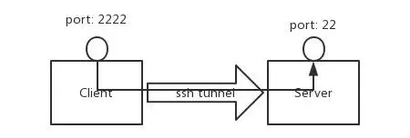
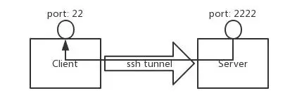
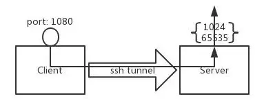
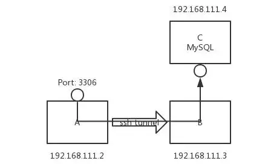
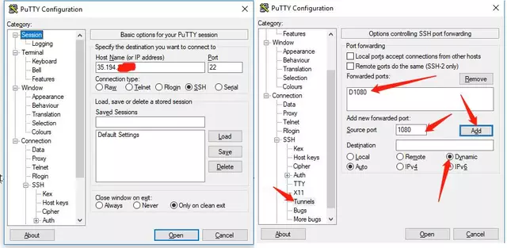
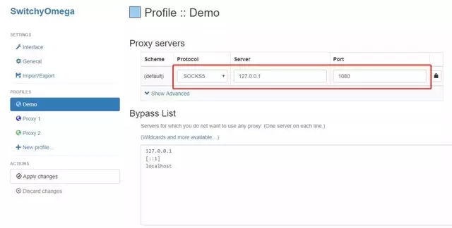
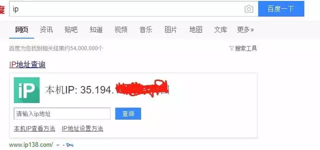
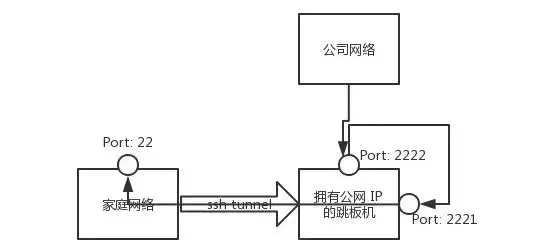

# 用 SSH 搭建一个简单代理服务器

- Keywords: SSH, Tunnel, Proxy, SSH-Tunnel, sshproxy

TOC

- [用 SSH 搭建一个简单代理服务器](#%e7%94%a8-ssh-%e6%90%ad%e5%bb%ba%e4%b8%80%e4%b8%aa%e7%ae%80%e5%8d%95%e4%bb%a3%e7%90%86%e6%9c%8d%e5%8a%a1%e5%99%a8)
  - [概述](#%e6%a6%82%e8%bf%b0)
  - [SSH端口转发](#ssh%e7%ab%af%e5%8f%a3%e8%bd%ac%e5%8f%91)
    - [端口转发分类](#%e7%ab%af%e5%8f%a3%e8%bd%ac%e5%8f%91%e5%88%86%e7%b1%bb)
    - [本地端口转发](#%e6%9c%ac%e5%9c%b0%e7%ab%af%e5%8f%a3%e8%bd%ac%e5%8f%91)
    - [远程端口转发](#%e8%bf%9c%e7%a8%8b%e7%ab%af%e5%8f%a3%e8%bd%ac%e5%8f%91)
    - [动态端口转发](#%e5%8a%a8%e6%80%81%e7%ab%af%e5%8f%a3%e8%bd%ac%e5%8f%91)
  - [端口转发实践](#%e7%ab%af%e5%8f%a3%e8%bd%ac%e5%8f%91%e5%ae%9e%e8%b7%b5)
    - [防火墙穿透](#%e9%98%b2%e7%81%ab%e5%a2%99%e7%a9%bf%e9%80%8f)
    - [简单的代理服务器](#%e7%ae%80%e5%8d%95%e7%9a%84%e4%bb%a3%e7%90%86%e6%9c%8d%e5%8a%a1%e5%99%a8)
      - [TODO](#todo)
    - [内网穿透](#%e5%86%85%e7%bd%91%e7%a9%bf%e9%80%8f)
  - [结束语](#%e7%bb%93%e6%9d%9f%e8%af%ad)
  - [Firefox](#firefox)
  - [SSH 命令的三种代理功能（-L/-R/-D）](#ssh-%e5%91%bd%e4%bb%a4%e7%9a%84%e4%b8%89%e7%a7%8d%e4%bb%a3%e7%90%86%e5%8a%9f%e8%83%bd-l-r-d)
    - [正向代理：](#%e6%ad%a3%e5%90%91%e4%bb%a3%e7%90%86)
    - [反向代理](#%e5%8f%8d%e5%90%91%e4%bb%a3%e7%90%86)
    - [本地 socks5 代理](#%e6%9c%ac%e5%9c%b0-socks5-%e4%bb%a3%e7%90%86)
    - [使用优化](#%e4%bd%bf%e7%94%a8%e4%bc%98%e5%8c%96)
    - [功能对比](#%e5%8a%9f%e8%83%bd%e5%af%b9%e6%af%94)
    - [iptable port-forwarding](#iptable-port-forwarding)
  - [Dynamic port forwarding using SSH, SOCKS5](#dynamic-port-forwarding-using-ssh-socks5)
    - [SSH Server /etc/ssh/sshd_config](#ssh-server-etcsshsshdconfig)
  - [SSH Client](#ssh-client)
    - [ssh command with arguments](#ssh-command-with-arguments)
    - [check proxy](#check-proxy)
    - [Firefox Browser](#firefox-browser)
    - [command with /etc/ssh/ssh_config or ~./ssh/config](#command-with-etcsshsshconfig-or-sshconfig)

## 概述

问题：

1. 所在网路因防火墙限制，导致一些协议、端口不能使用。
2. 想用 VPN ，但配置太麻烦。
3. 不通过 VPN ，想从公司访问家庭网络，或在家访问公司网络等。

如果你有遇到过上面的这些情况，本文会给你提供一种简单的解决方法。

## SSH端口转发

SSH 端口转发是 SSH 提供的一种机制，通过 Server 和 Client 之间的加密连接中继其它端口的流量。因为连接是加密的，所以对于传输使用未加密协议（如IMAP、VNC或IRC）的信息非常有用。

### 端口转发分类

SSH 端口转发一般分为两类：

1. 本地端口转发
2. 远程端口转发

### 本地端口转发

本地端口转发的作用是把 Client 的某个端口的流量通过 SSH 连接转发到 Server ，如图1所示。



图1 本地端口转发

命令格式如下：

```bash
ssh -L <local port>:<remote host>:<remote port> <SSH hostname>
```

假设 Client 地址是 192.168.111.2，Server 地址是 192.168.111.3。在Client 端执行如下命令：

```shellscript
root@client $ ssh -L 2222:localhost:22 192.168.111.3
```

通过上面的命令连接上 Server 后，即实现了本地端口转发。只要在 Client 上连接本地的 2222 端口等同于连接 Server 的 22 端口，如下两条命令是等价的，均是连接 Server 的 22 端口：

```shellscript
root@client $ ssh 127.0.0.1 -p 2222
root@client $ ssh 192.168.111.3 -p 22
```

但是这儿有个问题，就是 Client 的 2222 端口是监听在 lo 接口上的，因此只有 Client 可以连接，为了让其他主机也可以连接 Client 的 2222 端口，上面的命令需要加一个 -g 参数。

```shellscript
root@client $ ssh -gL 2222:localhost:22 192.168.111.3
```

这样外部其他主机也可以连接 Client 的 2222 端口了。

### 远程端口转发

与本地端口转发相对应的是远程端口转发，其作用是把 Server 的某个端口的流量通过 SSH 连接转发到 Client ，如图2所示。



图2 远程端口转发

命令格式如下：

```shellscript
ssh -R <remote port>:<local host>:<local port> <SSH hostname>
```

Client 上执行如下命令：

```shellscript
root@client $ ssh -R 2222:localhost:22 192.168.111.3
```

连接 Server 后，远程端口转发生效。此时在 Server 上连接本地的 2222 端口等同于连接 Client 的 22 端口，如下两条命令是等价的，均是连接 Client 的 22 端口：

```shellscript
root@server $ ssh 127.0.0.1 -p 2222
root@server $ ssh 192.168.111.2 -p 22
```

与本地端口转发不同，远程端口转发不能通过设置 -g 选项使外部主机连接 Server 的 2222 端口。

### 动态端口转发

另外除了本地端口转发和远程端口转发外，还有一个更方便的动态端口转发。与本地端口转发和远程端口转发把流量转发到某个固定主机的固定端口不同，动态端口转发是根据数据包的目的IP和目的端口实现动态转发的，工作机制类似于代理，如图3所示。



图3 动态端口转发

命令格式如下：

```shellscript
ssh -D <local port> <SSH hostname>
```

Client 上执行如下命令：

```shellscript
root@client $ ssh -D 1080 192.168.111.3
```

为了让外部机器也可以连接，需要添加-g 参数：

```shellscript
root@client $ ssh -gD 1080 192.168.111.3
```

如此，发往 Client 1080 端口的数据包将通过 SSH 连接发往 Server ，并在 Server 上重新发起请求。

## 端口转发实践

经过上面对 SSH 端口转发的介绍，了解了其基本用法。接下来我们着手解决文章开始列出的那几个问题。

### 防火墙穿透

假设现在有 A、B、C 三台服务器，C 服务器提供 MySQL 服务，并且防火墙限制只信任来自 B 服务器的流量，其他任何主机均拒绝访问任何端口。有时为了测试需要临时从 A 访问，此时如果修改防火墙策略的话会有些麻烦，还需要测试完后恢复。如果用 SSH 本地端口转发的话，一条命令就解决了，当测试完成后断开此连接即可恢复，此情况如图4所示。



图4 本地端口转发实例

命令如下：

```shellscript
root@A ssh -gL 3306:192.168.111.4:3306 192.168.111.3 -p 22
```

现在即可通过连接 A 服务器的 3306 端口，访问 C 服务的MySQL 服务了。

### 简单的代理服务器

在你用公共 WiFi 上网时，指不定有什么人在窥探你的数据包。为了保护自己的隐私，VPN 是一个很好的选择，但 VPN 配置有点麻烦，对于一些新手来说有点难度。此时通过 SSH 动态端口转发可以实现和 VPN 类似的效果。

为了用此功能，你首先需要一台有公网 IP 的服务器及 SSH 登陆权限。

接下来就是客户端的配置，此处以 Windows 为例（需要 SSH 连接工具 Putty ），配置如图5所示。



图5 Putty 配置

配置好点 open ，输入账号密码登陆即可。现在一个简单的代理服务已经运行起来了。接下来是浏览器的配置，这里以 Chrome 为例，配置如图6所示。



图6 浏览器配置

这里我用到了一个很好用的 Chrome 插件 “SwitchyOmega”，用于设置浏览器的代理。用其他代理插件或 Windows 自带的代理设置也是同样的配置：

```text
Proto: socks
Server: 127.0.0.1
Port: 1080
```

浏览器配置好后，在百度中搜索“IP”，即可看到我们的 IP 已经变成上面连接的那台服务器的地址了，如图7所示。



图7 代理测试

#### TODO

```shellscript
```shellscript
$ curl --socks5-hostname 127.0.0.1:1080 www.baidu.com
$ curl --socks5-hostname 127.0.0.1:1080 www.google.com
$ curl --socks5-hostname 127.0.0.1:1080 https://www.google.com
```
```
curl测试成功，Firefox可以通过Manual proxy configuration方式连接，Chrome可以通过插件 “Proxy SwitchyOmega”方式连接。但是Firefox和Chrome无法通过system proxy方式连接。

### 内网穿透

随着 IPv4 地址的枯竭，对于家庭用户而言很难获得一个公网 IP 地址，就我自己家的宽带来说，每次拨号只能获得一个私有 IP 地址。此时如果想在公司访问家庭网络的话，很难实现。

如果你有一台拥有公网 IP 的主机及 SSH 权限的话，上面的情况将迎刃而解。

由于远程端口转发的限制，需要做两次端口转发：一次远程端口转发把公网的 2221（因为绑定在 lo 上，所以只能本机访问） 端口转发到家庭主机的 22 端口，一次本地端口转发把公网的 2222 端口转发到 2221 端口，如图8所示。



图8 内网穿透

所需命令如下：

家庭主机上执行：

```shellscript
root@home $ ssh -R 2221:localhost:22 35.194.*.*
```

公网主机上执行：

```shellscript
root@public $ ssh -gL 2222:localhost:2221 localhost
```

此时准备工作已经完成。在任何 Internet 联通的地方，只要连接公网服务器的 2222 端口，即可登陆到家庭网络的主机上。

命令如下：

```shellscript
user@anywhere $ ssh -D 1080 35.194.*.* -p 2222
```

上面命令我们添加了动态端口转发参数。此时如果想访问家庭网络中其他主机上的资源的话，只要指定这个代理即可。

## 结束语

至此，我们已经完成了[SSH 端口转发](http://m.sohu.com/a/272431090_609423)的简要介绍，并通过几个实例展示了其在工作生活中的应用。

## Firefox

- [Web browsing over SSH](https://www.bitvise.com/ssh-web-browsing)

The recommended browser for this purpose is Firefox, because it can be configured to resolve DNS names through the SOCKS proxy, so the names of the websites you're browsing don't leak out through DNS queries.

## SSH 命令的三种代理功能（-L/-R/-D）

[SSH 命令的三种代理功能（-L/-R/-D）](https://zhuanlan.zhihu.com/p/57630633)

ssh 命令除了登陆外还有三种代理功能：

正向代理（-L）：相当于 iptable 的 port forwarding
反向代理（-R）：相当于 frp 或者 ngrok
socks5 代理（-D）：相当于 ss/ssr
如要长期高效的服务，应使用对应的专用软件。如没法安装软件，比如当你处在限制环境下想要访问下某个不可达到的目标，或者某个临时需求，那么 ssh 就是你的兜底方案。

### 正向代理：

所谓“正向代理”就是在本地启动端口，把本地端口数据转发到远端。

用法1：远程端口映射到其他机器

HostB 上启动一个 PortB 端口，映射到 HostC:PortC 上，在 HostB 上运行：

HostB$ ssh -L 0.0.0.0:PortB:HostC:PortC user@HostC
这时访问 HostB:PortB 相当于访问 HostC:PortC（和 iptable 的 port-forwarding 类似）。

用法2：本地端口通过跳板映射到其他机器

HostA 上启动一个 PortA 端口，通过 HostB 转发到 HostC:PortC上，在 HostA 上运行：

HostA$ ssh -L 0.0.0.0:PortA:HostC:PortC  user@HostB
这时访问 HostA:PortA 相当于访问 HostC:PortC。

两种用法的区别是，第一种用法本地到跳板机 HostB 的数据是明文的，而第二种用法一般本地就是 HostA，访问本地的 PortA，数据被 ssh 加密传输给 HostB 又转发给 HostC:PortC。

### 反向代理

所谓“反向代理”就是让远端启动端口，把远端端口数据转发到本地。

HostA 将自己可以访问的 HostB:PortB 暴露给外网服务器 HostC:PortC，在 HostA 上运行：

HostA$ ssh -R HostC:PortC:HostB:PortB  user@HostC
那么链接 HostC:PortC 就相当于链接 HostB:PortB。使用时需修改 HostC 的 /etc/ssh/sshd_config，添加：

GatewayPorts yes
相当于内网穿透，比如 HostA 和 HostB 是同一个内网下的两台可以互相访问的机器，HostC是外网跳板机，HostC不能访问 HostA，但是 HostA 可以访问 HostC。

那么通过在内网 HostA 上运行 ssh -R 告诉 HostC，创建 PortC 端口监听，把该端口所有数据转发给我（HostA），我会再转发给同一个内网下的 HostB:PortB。

同内网下的 HostA/HostB 也可以是同一台机器，换句话说就是内网 HostA 把自己可以访问的端口暴露给了外网 HostC。

按照前文《内网穿透：在公网访问你家的 NAS》中，相当于再 HostA 上启动了 frpc，而再 HostC 上启动了 frps。

### 本地 socks5 代理

在 HostA 的本地 1080 端口启动一个 socks5 服务，通过本地 socks5 代理的数据会通过 ssh 链接先发送给 HostB，再从 HostB 转发送给远程主机：

HostA$ ssh -D localhost:1080  HostB
那么在 HostA 上面，浏览器配置 socks5 代理为 127.0.0.1:1080，看网页时就能把数据通过 HostB 代理出去，类似 ss/ssr 版本，只不过用 ssh 来实现。

### 使用优化

为了更好用一点，ssh 后面还可以加上：-CqTnN 参数，比如：

$ ssh -CqTnN -L 0.0.0.0:PortA:HostC:PortC  user@HostB
其中 -C 为压缩数据，-q 安静模式，-T 禁止远程分配终端，-n 关闭标准输入，-N 不执行远程命令。此外视需要还可以增加 -f 参数，把 ssh 放到后台运行。

这些 ssh 代理没有短线重连功能，链接断了命令就退出了，所以需要些脚本监控重启，或者使用 autossh 之类的工具保持链接。

### 功能对比

正向代理（-L）的第一种用法可以用 iptable 的 port-forwarding 模拟，iptable 性能更好，但是需要 root 权限，ssh -L 性能不好，但是正向代理花样更多些。反向代理（-R）一般就作为没有安装 frp/ngrok/shootback 时候的一种代替，但是数据传输的性能和稳定性当然 frp 这些专用软件更好。

socks5 代理（-D）其实是可以代替 ss/ssr 的，区别和上面类似。所以要长久使用，推荐安装对应软件，临时用一下 ssh 挺顺手。

### iptable port-forwarding

补充下 iptable 的 port-forwarding 怎么设置，十分管用的功能，两个函数即可：

```bash
#! /bin/sh

# create forward rule by source interface
# http://serverfault.com/questions/532569/how-to-do-port-forwarding-redirecting-on-debian
PortForward1() {
    local IN_IF=$1
    local IN_PORT=$2
    local OUT_IP=$3
    local OUT_PORT=$4
    local IPTBL="/sbin/iptables"
    echo "1" > /proc/sys/net/ipv4/ip_forward
    $IPTBL -A PREROUTING -t nat -i $IN_IF -p tcp --dport $IN_PORT -j DNAT --to-destination ${OUT_IP}:${OUT_PORT}
    $IPTBL -A FORWARD -p tcp -d $OUT_IP --dport $OUT_PORT -j ACCEPT
    $IPTBL -A POSTROUTING -t nat -j MASQUERADE
}

# create forward rule by source ip
# http://blog.csdn.net/zzhongcy/article/details/42738285
ForwardPort2() {
    local IN_IP=$1
    local IN_PORT=$2
    local OUT_IP=$3
    local OUT_PORT=$4
    local IPTBL="/sbin/iptables"
    echo "1" > /proc/sys/net/ipv4/ip_forward
    $IPTBL -t nat -A PREROUTING --dst $IN_IP -p tcp --dport $IN_PORT -j DNAT --to-destination ${OUT_IP}:${OUT_PORT}
    $IPTBL -t nat -A POSTROUTING --dst $OUT_IP -p tcp --dport $OUT_PORT -j SNAT --to-source $IN_IP
}
```

第一个函数是按照网卡名称设置转发：

PortForward1 eth1 8765 202.115.8.2 8765
这时，本地 eth1 网卡的 8765 端口就会被转发给 202.115.8.2 的 8765 端口。

第二个函数是按照本机的 ip 地址，比如本机是 192.168.1.2：

PortForward2 192.168.1.2 8765 202.115.8.2 8765
那么任何访问本机 192.168.1.2 这个地址 8765 端口，都会被转发到 202.115.8.2:8765

这个 iptable 的 port forwarding 是内核层运行的，性能极好，只不过每次重启都需要重新设置下。

## [Dynamic port forwarding using SSH, SOCKS5](https://www.tuicool.com/articles/ZjE3Ubr)

```text
Dynamic port forwarding using SSH, SOCKS5 and a VPS
时间 2015-07-01 06:08:42  Hacker News
原文  http://medium.com/@antoniogioia/all-you-need-to-know-about-dynamic-port-forwarding-using-ssh-socks5-proxy-and-a-linux-debian-vps-c4503921400f
主题 SSH VPS socks
All you need to know about dynamic port forwarding using SSH, SOCKS5 proxy and a Linux Debian VPS

In this article i collected all the necessary information and useful tips to create SSH tunnels between hosts in order to protect internet traffic with an encrypted layer.

Contents:

What is SSH
Why you need to use a SSH tunnel
Public and private key pair
VPS setup and firewall
Dynamic port forwarding in details
Configure browser, email, instant messages
Optional configurations
Security considerations
What is SSH
SSH stands for Secure Shell and is described on Wikipedia as “a cryptographic (encrypted) network protocol for initiating text-based shell sessions on remote machines in a secure way”.

In other words SSH allows to connect to a port of a remote host using an encrypted link and through authentication you are able to run commands remotely using your own computer.

Basically you can run commands on a terminal of a computer located in New York sitting in your home in Paris.

SSH can do much more than this. For example you can copy files from local to remote host (local forward) or mount a remote file system on your computer (remote forward) or tunnel all traffic from a local SOCKS proxy (dynamic forward).

In this article i will explain how to forward unencrypted network traffic to a local SOCKS5 proxy and tunnel it to internet with SSH through a VPS (virtual private server).

SSH enables port forwarding with encrypted tunnel
SOCKS5 (Socket Secure) provides a proxy server to route traffic between client and server using authentication
VPS is our remote server that drives us out to internet
If you read till the end you’ll notice that everything falls into a couple of commands. In order to create a SSH tunnel described in the article are required:

Linux Debian on your machine, actually this method would work on any computer with SSH installed
VPS (a remote server) running Linux Debian 8, search on internet for a cheap and reliable one. With small syntax changes this method would work on any linux distribution
It is assumed you are familiar with terminal, SSH and Linux in general.

Why you need a SSH tunnel
The answer is simple: SSH dynamic port forwarding is the fastest and cheapest way to protect your traffic from undesired eyes.

Perhaps you are reading this article because you are concerned about your privacy or you are connecting from an open network without a VPN and you are scared that your passwords can be extracted with network analysis (spoiler: yes it’s very easy) or you just want to know more about alternative safe means of communications.

Governments, secret agencies, corporations, lamers and a bunch of other nasty entities are out there, avid of your personal data, to reuse, manipulate, sell it as they please. This is not lame conspiracy theories, it is actually proven facts and it’s time for everyone to wake up and be constantly aware of it. Use of SSH, VPNs, Tor and other tools can help you if used properly. The extensive collecting of data can turn problematic if not impossible to anyone interested in your identity.

SSH dynamic forward can help to protect your privacy.It is not intended to keep you anonymous and protect your identity. In conjunction with other tools you might actually protect your identity as well: it requires good technical skills, smart moves and proper tools.

Protection requires control and knowledge. It only takes learning a few commands and tweak some configuration file to achieve something huge in terms of protection of your data:

An additional layer to protect your identity
An encrypted channel of internet traffic
A less risky communication environment for your privacy
A few practical examples:

You can connect to open networks and no one can read in clear your network packets, assuming you carefully protect your private key
You can reach content blocked because of your location.
If you get a VPS located in the USA you can reach content blocked to IPs from outside the country
You can circumvent company firewall restrictions
Why not just use a VPN? If you are using a VPN (virtual private network) that’s great, you should always use it. VPN operates on a lower level and the routing part is taken care by OS. If configured properly encrypts communications between your networks around the globe and works great to protect your privacy. VPN configurations are easy to share between clients of different platforms as well. It suits well for home networks and businesses, easier to configure and relatively cheap.

Compared to a proper VPN, a SSH tunnel seems like VPN with less options and more difficult to handle on complex networks.Must be said that SSH is not a tool meant to build VPNs, as said earlier it’s used to securely obtain a prompt shell on a remote host. The options available is SSH for port forwarding makes it versatile to use as a simplified version of a VPN, working on TCP layer only.

If you are familiar with SSH sessions, setting up a SSH tunnel will result an easy and fast task that can turn useful in mobility or stealth mode without the need of a VPN.

Private and public key pair
The very first thing you need to setup is a private and public key pair.

With this keys you can authenticate your client (your machine) on your remote server. The mechanism is simple and effective:

Generate both keys, private and public, on your computer
Protect private key with long, possibly complex pass phrase. You need to enter it every time you want to create a SSH connection
Copy the public key on the server you want to log in
SSH opens a connection only to clients matching the server public key with the right client private key
This process ensures a higher level of security compared to passwords protected accounts vulnerable to brute force attacks.

You need to protect your private key and do not lose any backup. Anyone owning your private key can authenticate himself as you on every server that can match relative public key.

You can create a different keys pair for every service you intend to use with SSH. If one private key gets compromised you have then an isolated case.

Let’s create SSH keys. On your computer terminal type:

# ssh-keygen -t rsa
Next step is to choose a name for the keys. If you would just press enter it would assign the default name id_rsa and id_rsa.pub and those would became your default keys. I prefer instead to define a custom name for a pair used only for SSH tunnel: id_rsa_tunnel as private key and id_rsa_tunnel.pub as public one.

# Enter file in which to save the key (/home/user/.ssh/id_rsa): id_rsa_tunnel
Enter two times the pass phrase you want to use for your private key and you are done. Your keys are located in your home directory, /.ssh/ folder: /home/user/.ssh/id_rsa_tunnel (private) and /home/user/.ssh/id_rsa_tunnel.pub (public) where /user/ is the user you are logged in.

VPS setup and firewall
Your remote host, a VPS in this case, is going to route your traffic to internet. Choose the right VPS provider according to your needs. A monthly subscription can be as cheap as 5 dollars and allows you to create servers in real time, choose where to locate it, the OS to install (choose last Debian version) and the public key associated with root account. This few steps usually take up to 2 minutes to complete. At the end of process you should receive the public IP of the server. This is enough to connect with SSH.

On your computer it’s now convenient to change your hosts file, assuming the public IP of your VPS is 34.86.122.31 (i invented it) you can add this line to file /etc/hosts naming it “tunnel”:

# 34.86.122.31 tunnel
Save (you need to be root) and quit. From now on your system will recognize your VPS public IP with the word “tunnel”. You can now SSH to your remote host. Open a terminal and run:

# ssh root@tunnel
You’ll need to enter the passphrase to unlock connection.Enter it and if correct you’ll get into the VPS logged in as root.

If you didn’t associate your public key to root account during install process of your VPS you will be provided instead with a password and that’s not enough to protect your account. You will need to install SSH server and add your public key to authorized_keys file in /root/.ssh/ . There’s plenty of tutorials on the web that can help you.

You would assume the fresh OS install is up to date but to be 100% sure run:

# apt-get update && upgrade
and install new packages if any. Now you can install the tools needed:

# apt-get install sudo ufw
Sudo, you probably know it, is a package that grants administrative permissions to regular users and Ufw stands for Uncomplicated Firewall. Advanced linux users might want to install iptables instead, Uwf is easy to use and fits well for the task.

It’s time to create a regular user account and say goodbye to root. Go for a generic name like “sshuser” instead of your actual name or nickname and choose a password easy to remember and difficult to brute force, finally add user to sudo:

# useradd -s /bin/bash -m -d /home/sshuser -c "sshuser" sshuser
# passwd sshuser
# usermod -aG sudo sshuser
You can now exit and log out from root session.It’s now time to SSH into the VPS using the user account you just created but first you have to associate your public key with the new user account. There is a tool called ssh-copy-id that will help with this. You just have to run:

# ssh-copy-id sshuser@tunnel
and your default public key will be automatically copied securely to remote host (use option -i to define a custom public key). If you created the key pair following the article you have to type:

# ssh-copy-id -i ~/.ssh/id_rsa_tunnel.pub sshuser@tunnel
Now you can log in into your VPS with:

# ssh sshuser@tunnel
Enter the pass phrase and you are in.

It’s time to change the server SSH configuration in /etc/ssh/sshd_config

Open file with sudo and check the following lines, if not there add them:

Port 5432
Protocol 2
UsePrivilegeSeparation yes
PermitRootLogin no
StrictModes yes
PubkeyAuthentication yes
AuthorizedKeysFile      %h/.ssh/authorized_keys
PasswordAuthentication no
X11Forwarding no
TCPKeepAlive yes
AllowUsers sshuser
AllowTcpForwarding yes
SSH default port is 22. No one force you to use the default port and to obfuscate a little the traffic to potential attackers you can use port 5432 usually adopted by PostgreSQL.With PermitRootLogin and PasswordAuthentication we block possible easy attacks and with AllowUsers you restrict access even more to only your user.

Last step to strengthen your server is to configure a firewall. UFW, installed earlier, is quite simple firewall front end for the infamous iptables.All you have to do is allowing connections only to the port you want to connect and limit possible brute force attacks.

# sudo ufw allow 5432/tcp# ssh-copy-id sshuser@tunnel
Opens the TCP port 5432 from outside connections.

# sudo ufw limit 5432/tcp
Limits password log in attempts. Consider the use of SSHguard or fail2ban for a definitive solution to brute force attacks.

# sudo service ufw restart
Restart firewall to enable changes.Your remote server is now ready.

Dynamic port forwarding in details
You have now everything ready to create a SSH tunnel.

Open a terminal on your computer and type:

# ssh -D 8080 -N -p 5432 sshuser@tunnel -vv
If everything works as expected the tunnel is created after you type the pass phrase. That’s it.

The command in details:

-D enables dynamic forwarding
8080 is the port of localhost you are going to listen with proxy, can be any port open of your computer
-N stops SSH from executing commands
-p is the port of the remote host you connect to, you configured the firewall server to keep port 5432 open
-vv is very verbose output on console (-v and -vvv are less and more verbose). I suggest to keep this option the very first times to have a better idea of what’s going on with the SSH connection and remove it later on.
You can fork the process in the background and keep SSH quiet with the options -f and -q.

# ssh -D 8080 -fNq -p 5432 sshuser@tunnel
Tunnel is now up. All traffic can now be routed trough your localhost (or 127.0.0.1) from port 8080 to your VPS and then to internet.

Note this will work using your default private key.To specify the private key you created earlier use the option -i:

# ssh -i ~/.ssh/id_rsa_tunnel -D 8080 -fNq -p 5432 sshuser@tunnel
You SSH connection is now in the background. To close it you have to terminate the process; use htop to find and terminate it.

You need now to configure applications to make use of the tunnel.

Configure browser, email, instant messages
The connection reaches the VPS with the help of SOCKS protocol if your applications listen on port 8080 (or any port you have chosen).

All applications that create traffic not listening on SOCKS proxy will leak packets out of the tunnel. It’s important you configure all applications you normally use for internet to make use of the proxy.

Browser
Tunnel is created so let’s open a browser to access internet. You can open Chromium from terminal typing:

# chromium --temp-profile --proxy-server="socks5://localhost:8080"
Note the flag — proxy-server that tells Chromium where is located the proxy. This is enough to browse using the SSH tunnel.

You can add more flags to a Chromium session, there is plenty listed here . Why not running incognito mode and disable most functionalities you don’t use:

# chromium --temp-profile --incognito --no-referrers --enable-strict-mixed-content-checking --disable-java --disable-extensions --disable-plugins --no-experiments --no-pings --disable-preconnect --disable-translate --dns-prefetch-disable --disable-background-mode --proxy-server="socks5://localhost:8080"
Add or remove flags depending on your needs.

To configure Firefox (or Iceweasel) click on the menu icon and go to Preferences. Click on the tab Advanced and on the inner tab Network. Finally click on Settings button and click on “Manual proxy configuration” typing “localhost” in the field next to SOCKS Host, port 8080. Click on SOCKS v5 if not selected. Click on OK and your browsing should now be encrypted.

Watch out for DNS leaks using Firefox (or Iceweasel). Open the config window typing about:config where you would type a URL and press enter. Search for network.proxy.socks_remote_dns and set it to true. Test results before and after the changes on dnsleaktest.com .

E-mail
The procedure to enable SOCKS proxy on Thunderbird (or Icedove) is similar as for Firefox described above. Menu, Preferences, Preferences, Advanced, Network and Disk Space, Settings and then configure proxy same way.

Instant messaging
Pigdin is a universal chat client that supports most common protocols and social network chats. In one application you can chat over many networks and in combination with OTR plugin you can encrypt your messages over not secure networks. You can configure Pidgin to use the proxy as well, just open Preferences and under Network label you can set the Proxy Server as SOCKS5, host is “localhost” and port 8080.

If you are more old school and chat over IRC with irssi client, type within the console:

/set proxy_address 127.0.0.1
/set proxy_port 8080
/set use_proxy ON
Note that 127.0.0.1 is the address of localhost.

Optional configurations
You now have a working SSH tunnel. You can now create a shortcut for future sessions. You can also run a script at boot time that opens a tunnel in background. You can find many examples on internet about it. I personally prefer to create and delete tunnels as i need it, without any automation.

Remember the command to open a tunnel:

# ssh -i ~/.ssh/id_rsa_tunnel -D 8080 -fNq -p 5432 sshuser@tunnel
To create a shortcut to this command edit or create a config file on your computer at: /home/user/.ssh/config and add the lines:

Host tunnel
    HostName 34.86.122.31
    Port 5432
    User sshuser
    IdentityFile ~/.ssh/id_rsa_tunnel.pub
And to open a SSH tunnel you can type:

# ssh -fNq tunnel
Security considerations
Leaking your traffic and IP trough applications, misconfigurations and low focus is very easy.

The use of Linux helps to have better control over applications running. This would be a hell on Windows machines with so many hidden connections. In order to have a successful SSH tunnel use it’s essential that every application connecting to internet is configured to use SOCKS proxy.

Do not forget that when the modem drops the connection to internet the tunnel is deleted as well. If applications are configured to automatically connect to internet as soon signal is back and you are not there to bring the tunnel up, they would connect without the tunnel, leaking your IP.

If your intention is to hide your identity do not forget that the traffic of a SSH tunnel is encrypted until goes out of your remote host. This means that if your identity is associated with the public IP of your VPS it’s possible to match all your traffic and your possible sins.

VPN, VPS and Tor exit nodes might be flagged by ISP and communication filtered or monitored. In our setup the VPS is the weakest point regarding trust, you should change often provider and check if your IP is in black lists.

In case of investigations your ISP and your VPS provider might handle the logs relative your connection and server, if you pay the VPS services using your credit card you cannot really hide. Keep this in mind and think of counter measures actively. You should consider the use of Tor to protect your identity.

If hiding your identity is not your primary concern and you own a remote host that you can trust, SSH dynamic port forwarding is a valid option to protect your privacy on your local network without VPN infrastructure.

Feel free to correct me if the information is not correct or outdated.
```

### SSH Server /etc/ssh/sshd_config

- https://www.ssh.com/ssh/config/
- https://www.ssh.com/ssh/tunneling/example
- https://gist.github.com/kjellski/5940875
- https://unix.stackexchange.com/questions/344444/match-multiple-users-in-sshd-config

```text
# linux-6$ /etc/init.d/sshd restart
# linux-6$ service sshd restart
# linux-7$ systemctl restart sshd.service
# Example of overriding settings on a per-user basis
Match User opc
    AllowTcpForwarding yes
    AllowStreamLocalForwarding yes
    GatewayPorts yes
    PermitTunnel yes
#   optional
#   X11Forwarding yes
#   AllowAgentForwarding yes
#   PermitTTY no
#   ForceCommand cvs server
#   PermitListen 127.0.0.1:2223
#   AcceptEnv RESTIC_REPOSITORY RESTIC_PASSWORD
#   ForceCommand /bin/echo 'We talked about this guys. No SSH for you!'
#Match Address 172.22.100.0/24,172.22.5.0/24,127.0.0.1
#    PermitRootLogin without-password
#    PasswordAuthentication yes
#Match Group users_with_no_ssh
#    PasswordAuthentication yes
#    AllowTCPForwarding yes
#    ForceCommand /bin/echo 'We talked about this guys. No SSH for you!'
```

## SSH Client

### ssh command with arguments

- LocalForward
  - ssh -i ~/.ssh/ssh-private.openssh -o StrictHostKeyChecking=no -o UserKnownHostsFile=/dev/null opc@132.145.83.209 -gL 3389:10.0.0.3:3389 [-vvv]
    - exit
- DynamicForward
  - ssh -i ~/.ssh/ssh-private.openssh -o StrictHostKeyChecking=no -o UserKnownHostsFile=/dev/null opc@132.145.83.209 -gD 1080 [-vvv]
    - exit
  - nohup ssh localhost -N -o "DynamicForward 1080" > socks.log&
  - ssh -D 1080 -fNq -p 5432 sshuser@tunnel
    - -N stops SSH from executing commands
    - -vv is very verbose output on console (-v and -vvv are less and more verbose).
    - You can fork the process in the background and keep SSH quiet with the options -f and -q.
    - You SSH connection is now in the background. To close it you have to terminate the process; use htop to find and terminate it.

### check proxy

  - netstat -nalt | grep 1080
  - curl --socks5-hostname 127.0.0.1:1080 www.google.com
  - curl --socks5-hostname 127.0.0.1:1080 https://www.google.com
  - [whatismyip: SSH-Client-IP](curl -s -m 10 http://whatismyip.akamai.com/)
  - [whatismyip: SSH-Server-IP](https://www.whatismyip.com/)

### Firefox Browser

- [URL](about:preferences#general) or [search: proxy](about:preferences#searchResults)
  - Network Settings
    - Manual proxy configuration
      - Must leave HTTP Proxy blank
      - Socks Host: 127.0.0.0
      - Port: 1080
      - Checked: Socks v5
    - Checked: Proxy DNS when using SOCKS v5
    - Checked: Enable DNS over HTTPS
- [whatismyip: SSH-Client-IP](curl -s -m 10 http://whatismyip.akamai.com/)
- [whatismyip: SSH-Server-IP](https://www.whatismyip.com/)

### command with /etc/ssh/ssh_config or ~./ssh/config

```text
# ~/.ssh/config
Host *
  StrictHostKeyChecking no
  UserKnownHostsFile /dev/null
Host proxy
  HostName 132.145.83.209
  User opc
  Port 22
  IdentityFile ~/.ssh/ssh-private.openssh
  DynamicForward 1080
```

TODO verify ~/.ssh/config for client
#https://www.ssh.com/ssh/config/
Host *
  ForwardAgent no
  ForwardX11 no
  ForwardX11Trusted yes
  User opc
  Port 22
  Protocol 2
  ServerAliveInterval 60
  ServerAliveCountMax 30
  StrictHostKeyChecking no
  UserKnownHostsFile /dev/null
#https://www.ssh.com/ssh/tunneling/example
#https://stackoverflow.com/questions/18704195/how-to-add-socks-proxy-to-ssh-config-file
#touch ~/.ssh/config
#chmod 600 ~/.ssh/config
#chmod 600 <~/.ssh/OpenSSH-Private-Key>
#execute `ssh proxy` on local-host
#netstat -nalt | grep <local-host-port>
#curl --socks5-hostname 127.0.0.1:1080 www.baidu.com
Host proxy
  HostName <ssh-server>
  User <username>
  Port <ssh-server-port>
  IdentityFile <~/.ssh/OpenSSH-Private-Key>
  StrictHostKeyChecking no
  UserKnownHostsFile /dev/null
  #LocalForward <local-host-port> <remote-host>:<remote-host-port>
  #RemoteForward <ssh-server-port> <local-host>:<local-host-port>
  DynamicForward <local-host-port>
